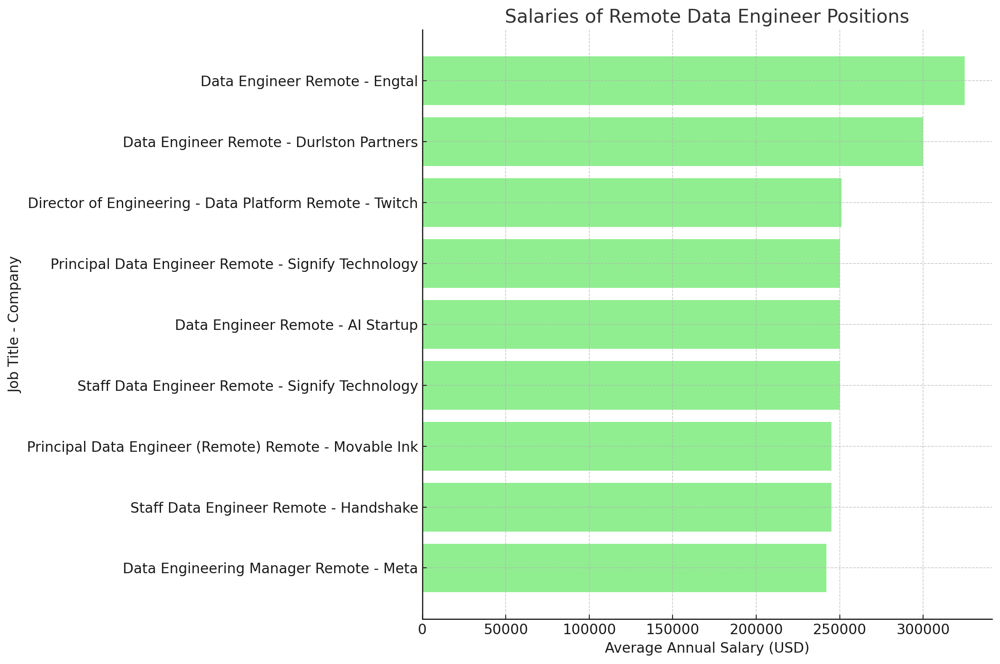
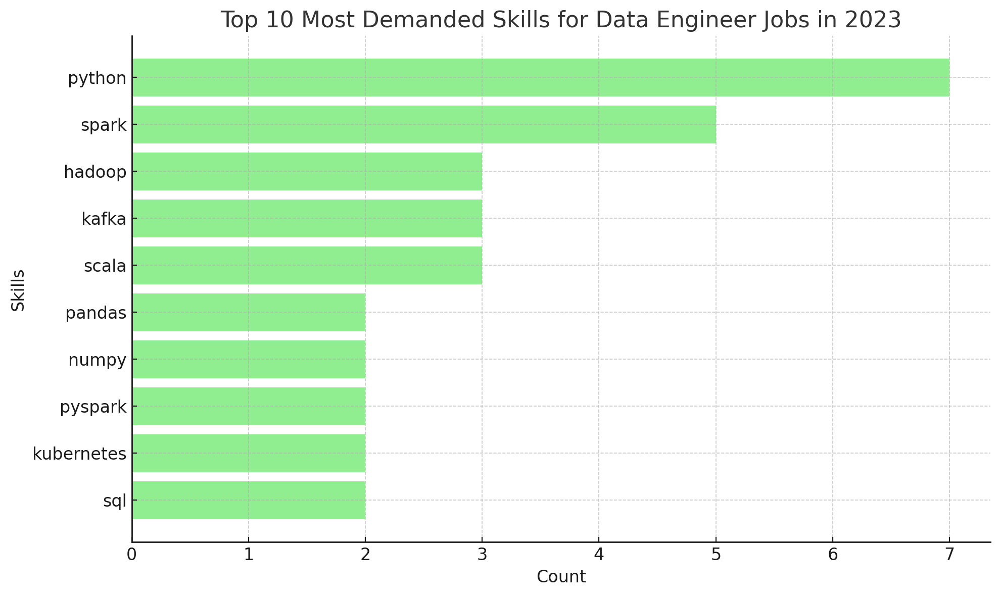

# Introduction
This is my first SQL project, which analyzes the Data Engineer job market for 2023. It explores top-paying jobs, in-demand skills for this role, and where high demand meets high salary in Data Engineering.

You can check my SQL queries in [project_sql folder](/project_sql/)

# Background
This project was created to better understand the data engineer job market, aiming to identify the top-paying and most popular skills, making it easier to find the best job opportunities.
### The questions I aimed to answer through my SQL queries were:
1. What are the top-paying data engineer jobs?
2. What skills are required for these top-paying jobs?
3. What skills are most in demand for data engineer?
4. Which skills are associated with higher salaries?
5. What are the most optimal skills to learn?

# Tools I used
To explore the data engineer job market in depth, I used several essential tools:

- **SQL**: The core of my analysis, used to query the database and extract important insights.
- **PostgreSQL**: The database management system I selected, perfect for managing job posting data.
- **Visual Studio Code**: My preferred tool for managing the database and running SQL queries.
- **Git & GitHub**: Crucial for version control and sharing my SQL scripts and analysis, enabling collaboration and project tracking.

# The Analysis

For this project, each query was designed to explore specific aspects of the data engineer job market. Here’s how I tackled each question:
### 1. What are the top-paying data engineer jobs?

I filtered data engineer positions by average annual salary and location, with a focus on remote jobs, to identify the highest-paying roles. This query pinpoints top earning opportunities in the field.

```sql 
SELECT
    job_id,
    job_title,
    job_location,
    job_schedule_type,
    salary_year_avg,
    job_posted_date,
    name AS company_name
FROM
    job_postings_fact
LEFT JOIN company_dim ON job_postings_fact.company_id = company_dim.company_id
WHERE
    job_title_short = 'Data Engineer' AND
    job_location = 'Anywhere' AND
    salary_year_avg IS NOT NULL    
ORDER BY
    salary_year_avg DESC
LIMIT 10
```

Here's the breakdown of the top **data engineer** jobs in 2023:
- **Wide Salary Range**: Top 10 paying data engineer roles span from $242,000 to $325,000, indicating significant salary potential in the field.
- **Diverse Employers**: Companies like Engtal, Signify Technology and Meta are among those offering high salaries, showing a broad interest across different industries.
- **Job Title Variety**: There's a high diversity in job titles, from Data Engineer to Director of Engineering, reflecting varied roles and specializations within data engineering.

 
*This graph visualising the salary for the top 10 salaries for data engineers; ChatGPT generated this graph from my SQL query results*

### 2. What skills are required for these top-paying jobs?

To uncover the skills needed for the highest-paying jobs, I joined job postings with skills data, revealing what employers prioritize for high-compensation roles.

```sql 
WITH top_paying_jobs AS (
    SELECT
        job_id,
        job_title,
        job_location,
        job_schedule_type,
        salary_year_avg,
        job_posted_date,
        name AS company_name
    FROM
        job_postings_fact
    LEFT JOIN company_dim ON job_postings_fact.company_id = company_dim.company_id
    WHERE
        job_title_short = 'Data Engineer' AND
        job_location = 'Anywhere' AND
        salary_year_avg IS NOT NULL    
    ORDER BY
        salary_year_avg DESC
    LIMIT 10
)
SELECT 
    top_paying_jobs.*,
    skills
FROM top_paying_jobs
INNER JOIN skills_job_dim ON top_paying_jobs.job_id = skills_job_dim.job_id
INNER JOIN skills_dim ON skills_job_dim.skill_id = skills_dim.skill_id
ORDER BY 
    salary_year_avg DESC
```
Here's the breakdown of the most demanded skills for data engineers in 2023, based on job postings:

- **Python** is leading with a count of 7.
- **Spark** follows with a count of 5.
- Skills like **Hadoop, Kafka,** and **Scala** are also in demand, each with a count of 3.
- Other skills such as **Pandas, Numpy,** and **Pyspark** show varying degrees of demand, indicating a diverse skill set requirement for data engineering roles.


*This graph visualising top 10 in-demand skills for data engineers; ChatGPT generated this graph from my SQL query results*
### 3. What skills are most in demand for data engineer in New Zealand?

This query identified the skills most commonly requested in New Zealand job postings, highlighting the areas with the highest demand.
```sql 
SELECT 
    skills,
    COUNT (skills_job_dim.job_id) AS demand_count
FROM job_postings_fact
INNER JOIN skills_job_dim ON job_postings_fact.job_id = skills_job_dim.job_id
INNER JOIN skills_dim ON skills_job_dim.skill_id = skills_dim.skill_id
WHERE
    job_title_short = 'Data Engineer' AND
    job_location = 'New Zealand'
GROUP BY
    skills
ORDER BY
    demand_count DESC
LIMIT 5
```
Here's the breakdown of the most demanded skills for data engineer in New Zealand in 2023
- **SQL, AWS** and **Azure** remain fundamental, emphasizing the need for strong foundational skills in data processing and cloud manipulation.
- **Python** and **Snowflake** are essential, pointing towards the increasing importance of technical skills in data engineering.

| Skills    | Demand Count |
|-----------|--------------|
| SQL       | 27           |
| AWS       | 23           |
| Azure     | 19           |
| Python    | 14           |
| Snowflake | 14           |

*Table of the demand for the top 5 skills in data engineer job postings in New Zealand*

### 4. Which skills are associated with higher salaries in New Zealand?
Exploring the average salaries linked to different skills revealed which skills offer the highest pay in New Zealand.

```sql
SELECT 
    skills,
    ROUND(AVG(salary_year_avg), 0) AS avg_salary
FROM job_postings_fact
INNER JOIN skills_job_dim ON job_postings_fact.job_id = skills_job_dim.job_id
INNER JOIN skills_dim ON skills_job_dim.skill_id = skills_dim.skill_id
WHERE
    job_title_short = 'Data Engineer' AND
    job_location = 'New Zealand' AND
    salary_year_avg IS NOT NULL
GROUP BY
    skills
ORDER BY
    avg_salary DESC
LIMIT 25
```
Here’s a summary of the top-paying skills for Data Engineers:

- **High Demand** for Cloud and Data Tools: Expertise in cloud platforms (AWS, Azure) and data storage technologies (BigQuery, Redshift, Snowflake) leads to top salaries, underscoring the industry's focus on cloud-based data management and processing.

- **Proficiency in Big Data and Workflow Orchestration**: Skills in big data technologies (Spark, Kafka) and workflow orchestration tools (Airflow, Kubernetes) are highly valued, reflecting the importance of efficient data pipeline management and large-scale data processing.

- **Versatile Programming Skills**: Proficiency in programming languages such as Python and Scala is well-compensated, highlighting the need for coding versatility in developing and optimizing data pipelines in modern data engineering roles.

### 5. What are the most optimal skills to learn?

By combining insights from demand and salary data, this query aimed to identify skills that are both highly sought after and well-paid, providing a strategic guide for skill development.
```sql
SELECT
    skills_dim.skill_id,
    skills_dim.skills,
    COUNT(skills_job_dim.job_id) AS demand_count,
    ROUND(AVG(job_postings_fact.salary_year_avg), 0) AS avg_salary
FROM job_postings_fact
INNER JOIN skills_job_dim ON job_postings_fact.job_id = skills_job_dim.job_id
INNER JOIN skills_dim ON skills_job_dim.skill_id = skills_dim.skill_id
WHERE
    job_title_short = 'Data Engineer' AND
    job_work_from_home = TRUE AND
    salary_year_avg IS NOT NULL
GROUP BY
    skills_dim.skill_id
HAVING
    COUNT(skills_job_dim.job_id) > 10
ORDER BY
    avg_salary DESC,
    demand_count DESC
LIMIT
    25;
```
## Skills Demand and Salary Data

| Skill ID | Skills        | Demand Count | Average Salary ($)|
|----------|---------------|--------------|-------------------|
| 213      | kubernetes    | 56           | 158,190           |
| 94       | numpy         | 14           | 157,592           |
| 63       | cassandra     | 19           | 151,282           |
| 98       | kafka         | 134          | 150,549           |
| 27       | golang        | 11           | 147,818           |
| 212      | terraform     | 44           | 146,057           |
| 93       | pandas        | 38           | 144,656           |
| 59       | elasticsearch | 21           | 144,102           |
| 144      | ruby          | 14           | 144,000           |
| 30       | ruby          | 14           | 144,000           |

Here are three key insights:

- **High Demand vs. High Salary Disparity:**

While Kubernetes and Kafka skills have the highest demand counts (56 and 134 respectively), the highest average salary is associated with Kubernetes ($158,190). However, Kafka, despite having a significantly higher demand (134), offers a lower average salary ($150,549). This suggests that higher demand does not necessarily correlate with the highest pay.

- **Specialized Skills with High Salaries:**

Skills like Kubernetes, Numpy, and Cassandra, though not the most in-demand, command some of the highest average salaries ($158,190, $157,592, and $151,282 respectively). This indicates that specialized technical skills can offer lucrative compensation, even with moderate market demand.

- **Emerging Technologies with Growing Demand:**

Technologies such as Spark (demand count: 237) and Airflow (demand count: 151) show strong demand but have lower average salaries ($139,838 and $138,518, respectively) compared to more niche technologies. This trend suggests that while these technologies are widely adopted, the market might be more saturated, leading to relatively lower salaries compared to less common, high-demand skills.

# What I learned
During this journey, I’ve significantly enhanced my **SQL skills** with powerful techniques:

- **Complex Query Crafting**: I’ve mastered advanced SQL skills, expertly merging tables and using WITH clauses to handle temporary tables.
- **Data Aggregation**: I’ve leveled GROUP BY and made aggregate functions like COUNT() and AVG() for summarizing data.
- **Analytical Expertise**: I’ve developed strong problem-solving skills, transforming questions into actionable and insightful SQL queries.
# Conclusion
This SQL project explored the 2023 Data Engineer job market, focusing on top-paying roles, high-demand skills, and optimal skills for growth. Key insights revealed that high salaries are linked to skills like Python, Spark, and cloud technologies, while skills like Kubernetes and Numpy offer a strong balance between demand and pay. Foundational skills such as SQL, AWS, and Azure are highly sought after, especially in New Zealand. The project also sharpened my SQL skills in complex queries and data analysis. For more details, see the project_sql folder.